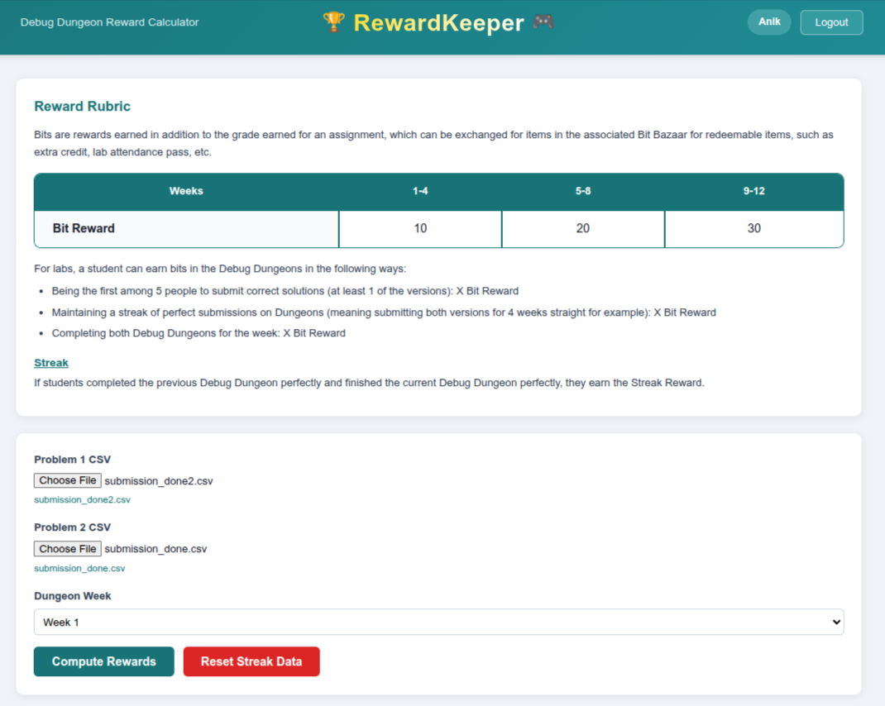
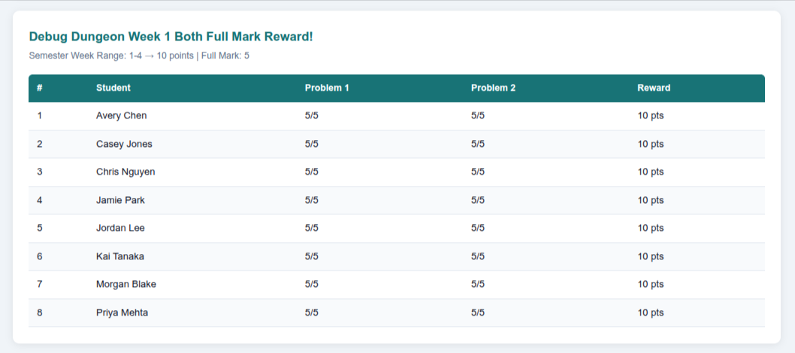
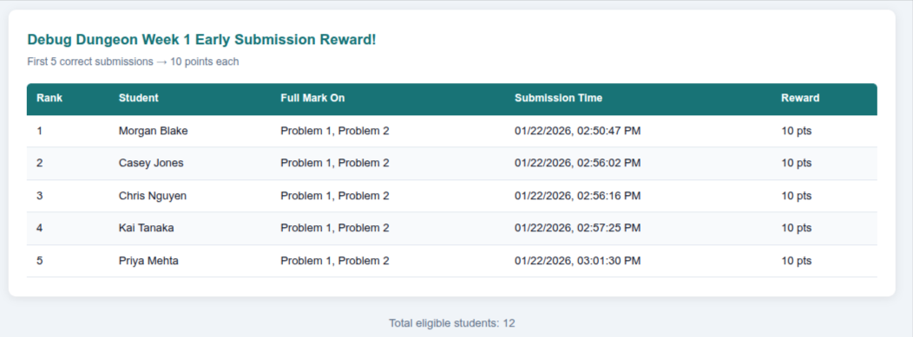
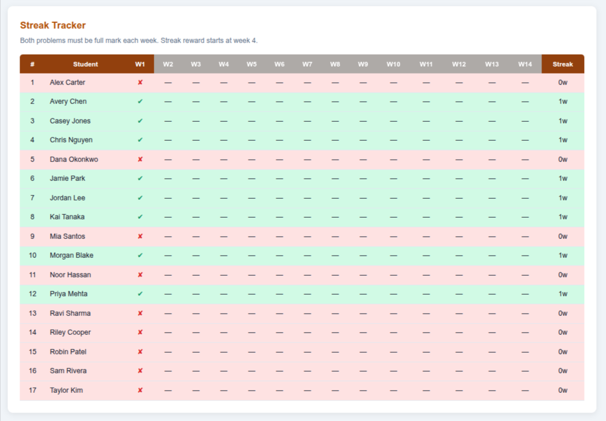

# RewardKeeper

> Automated Debug Dungeon reward calculator for CSC1100 lab sections at Wayne State University.

**Author:** Anik Tahabilder — PhD Student, Department of Computer Science, Wayne State University

---

## Background

[**Prizeversity**](https://prizeversity.com) is a gamification-of-learning platform used in CSC1100 (Computer Science I) at Wayne State University, designed by **Professor Hadi Nassar**. Students earn "Bit" points for their lab performance — completing Debug Dungeon challenges, submitting early, and maintaining streaks of perfect scores. These Bit points can be redeemed in the **Bit Bazaar** for items such as extra credit, lab attendance passes, and more.

As a lab instructor for CSC1100, I built **RewardKeeper** to automate the reward calculation process. Professor Nassar provided the reward structure and rules; this tool implements them so that lab instructors can compute rewards by uploading gradesheet CSVs each week instead of manually tallying points.

---

## Screenshots

### Dashboard
Upload two gradesheet CSVs, select the week, and compute rewards.

<p align="center">
  
</p>

### Both Full Mark Reward
Students who scored full marks on both problems earn Bit points.

<p align="center">
  
</p>

### Early Submission Reward
The first 5 students to submit a correct solution earn Bit points.

<p align="center">
  
</p>

### Streak Tracker
14-week grid tracking consecutive perfect scores. Green rows indicate an active streak; red rows indicate a broken streak.

<p align="center">
  
</p>

---

## Overview

Each week, students submit solutions to two Debug Dungeon problems on the course platform. Lab instructors download the gradesheets as CSV files and upload them to RewardKeeper. The app computes three types of rewards:

| Reward | Description |
|--------|-------------|
| **Both Full Mark** | Students who scored full marks on **both** problems |
| **Early Submission** | First 5 students to submit a correct solution (at least one problem) |
| **Streak** | Consecutive weeks of perfect scores starting from week 1 (activates at week 4) |

Bit point values scale with semester progress:

| Weeks | 1–4 | 5–8 | 9–14 |
|-------|:---:|:---:|:----:|
| **Bit Reward** | 10 | 20 | 30 |

---

## Features

- **Per-TA login & data isolation** — Each lab instructor has a separate session. Data is stored per-TA in the database, keeping sections independent.
- **Persistent streak tracking** — Week results are saved to SQLite. On login, the streak table loads automatically from existing data.
- **CSV upload & instant results** — Upload two gradesheet CSVs (one per problem), select the week, and see results immediately.
- **Per-section reset** — Each TA can clear only their own section's data without affecting others.

---

## Tech Stack

| Layer | Technology |
|-------|-----------|
| Frontend | React 19, Vite |
| Backend | Python, FastAPI |
| Database | SQLite |
| Styling | Plain CSS |

---

## Project Structure

```
RewardKeeper/
├── backend/
│   ├── main.py              # FastAPI endpoints (login, compute, reset, streak)
│   ├── db.py                # SQLite schema & queries (per-TA isolation)
│   ├── rewards.py           # Core reward computation logic
│   └── requirements.txt     # Python dependencies
│
├── frontend/
│   ├── index.html
│   ├── package.json
│   ├── vite.config.js
│   └── src/
│       ├── main.jsx         # React entry point
│       ├── App.jsx          # Main app (login state, API calls, layout)
│       ├── App.css          # All styles
│       └── components/
│           ├── Login.jsx        # Login modal
│           ├── Rubric.jsx       # Reward rubric display
│           ├── UploadForm.jsx   # CSV upload & week selector
│           ├── ResultsTable.jsx # Reusable results table
│           ├── Summary.jsx      # Pass/fail summary
│           └── StreakTable.jsx   # 14-week streak tracker grid
│
├── images/                  # Screenshots for documentation
├── sample_data/
│   ├── submission_done.csv  # Dummy Problem 1 gradesheet (fictitious names)
│   └── submission_done2.csv # Dummy Problem 2 gradesheet (fictitious names)
│
├── .gitignore
├── LICENSE
└── readme.md
```

---

## Prerequisites

- **Python** 3.10+
- **Node.js** 18+
- **npm**

---

## Getting Started

### 1. Clone the repository

```bash
git clone https://github.com/atahabilder1/RewardKeeper.git
cd RewardKeeper
```

### 2. Backend setup

```bash
cd backend
python -m venv venv
source venv/bin/activate          # Windows: venv\Scripts\activate
pip install -r requirements.txt
```

### 3. Start the backend

```bash
uvicorn main:app --reload --port 8000
```

API docs available at `http://localhost:8000/docs`.

### 4. Frontend setup

Open a **new terminal**:

```bash
cd frontend
npm install
```

### 5. Start the frontend

```bash
npm run dev
```

Open `http://localhost:5173` in your browser.

---

## Usage

1. Open `http://localhost:5173`.
2. Click **Login** (or try to compute — it will prompt you to log in).
3. Enter your TA credentials (see below).
4. Go to the **Debug Dungeon** grading page on the course platform. For each problem, **download the gradesheet as a CSV** file. You will have two CSVs per week — one for Problem 1 and one for Problem 2.
5. Upload the two CSV files and select the corresponding week number.
6. Click **Compute Rewards** to see results.
7. The **Streak Tracker** persists across sessions — log out and back in, and your data is still there. Repeat each week to build the streak history.
8. Use **Reset Streak Data** to clear all saved data for your section only.

---

## TA Credentials

| Username | Password |
|:--------:|:--------:|
| `anik`   | `anik`   |
| `urshi`  | `urshi`  |
| `aditi`  | `aditi`  |
| `test`   | `test`   |

---

## Sample Data

The `sample_data/` folder contains two dummy CSV files for testing. These files use **fictitious student names only** — they do not represent real students. The grade distribution and timestamps mirror a realistic scenario so you can try the full workflow without actual gradesheets.

**To test:** Log in with any credential, upload `submission_done.csv` as Problem 1 and `submission_done2.csv` as Problem 2, select a week, and click Compute Rewards.

---

## CSV Format

The uploaded CSVs must be UTF-8 encoded with the following columns:

| Column | Description | Example |
|--------|-------------|---------|
| `#` | Student ID | `1` |
| `Student` | Student name | `Alex Carter` |
| `Test Result` | Test result string | `1 passed of 1` |
| `Grade` | Numeric grade | `5` |
| `Submission Date` | Timestamp | `01/22/2026, 2:57:12 PM` |

---

## API Reference

| Method | Endpoint | Description |
|--------|----------|-------------|
| `POST` | `/api/login` | Authenticate (fields: `username`, `password`) |
| `GET`  | `/api/streak/{ta_name}` | Get saved streak history for a TA |
| `POST` | `/api/compute` | Upload CSVs & compute rewards (fields: `problem1`, `problem2`, `week`, `ta_name`) |
| `POST` | `/api/reset` | Clear saved data for a TA (field: `ta_name`) |

---

## License

This project is licensed under the [MIT License](LICENSE).
